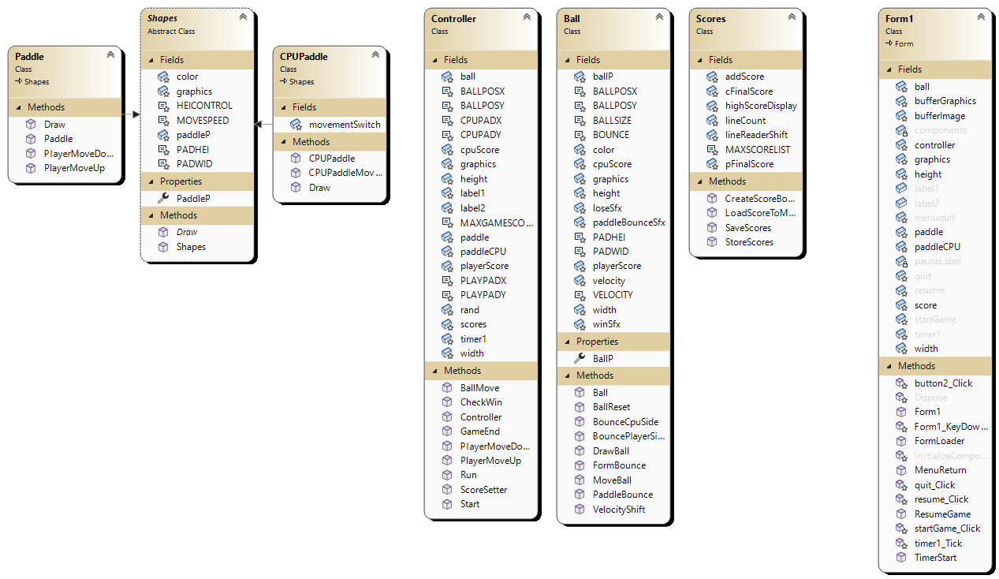

# Diagram
 

# References
 
Adding and using audio files
 
https://stackoverflow.com/questions/4125698/how-to-play-wav-audio-file-from-resources
 
 
Codecademy c# tutorial courses for extra information
 
 
Finding information on returning values to label and updating.
 
https://stackoverflow.com/questions/40830010/how-to-print-my-score-on-another-winform
 
https://stackoverflow.com/questions/10770920/how-to-change-a-label-from-another-class-c-sharp-windows-forms-visual-studio
 
 
Rough idea of ball bounce inspired from this.
 
https://social.msdn.microsoft.com/Forums/vstudio/en-US/d8170d63-c7a3-42c0-8f0e-9dfa86767feb/creating-pong-in-c-bouncing-the-ball-off-of-walls-and-paddles-issue?forum=csharpgeneral
 
 
Audio Used:
 
https://undertale-resources.tumblr.com/categories
 
 
Appending new lines to streamwriter
 
https://stackoverflow.com/questions/7306214/append-lines-to-a-file-using-a-streamwriter
 
(Second answer)
 
 
Using file.ReadAllLines to parse txt file
 
https://stackoverflow.com/questions/12633815/lines-of-a-streamreader-to-an-array-of-string
 
(Second answer - Update)
